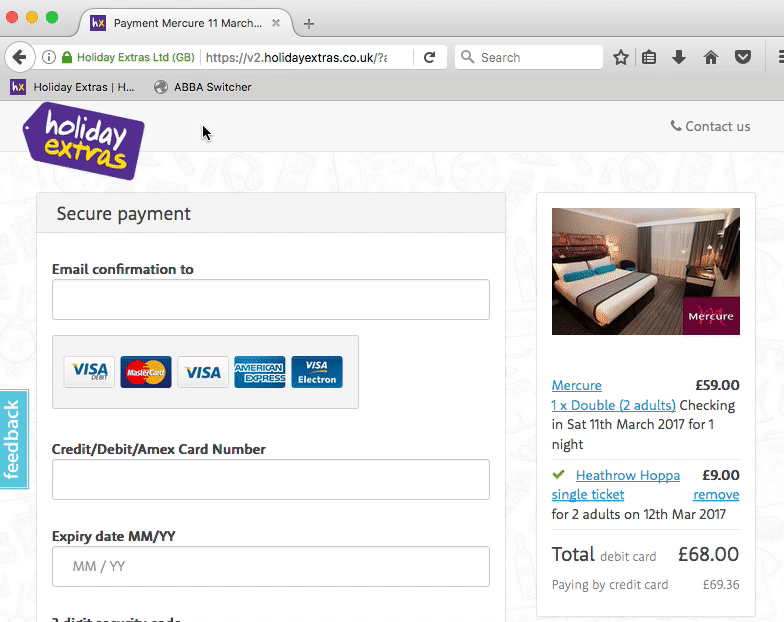
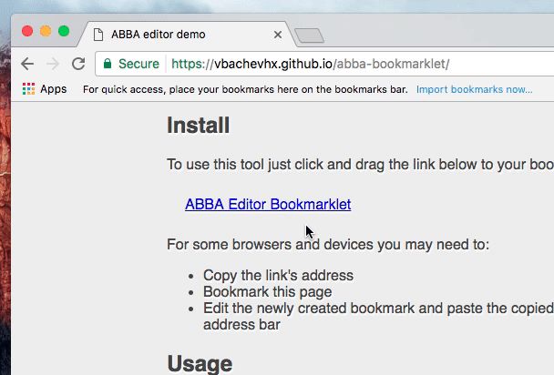
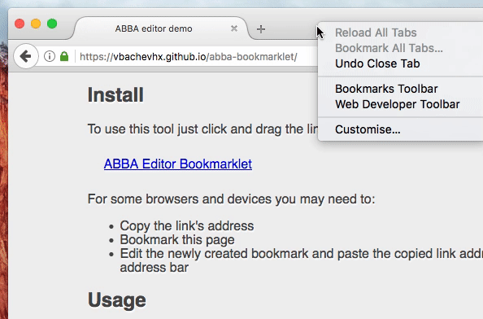
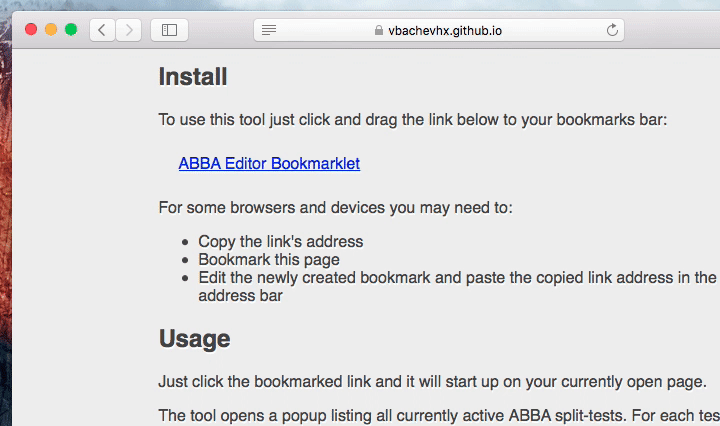

# ABBA test switcher bookmarklet

This bookmarklet lets you switch between the variants of currently running ABBA split-tests. Switching is done via editing split-test cookie values.

The bookmarklet reads split-test data out of the `hx.abba._tests` object which is exposed on the `tripapp` platform of `holidayextras.co.uk` (i.e. it'll only work there).

## Usage

The tool opens a popup listing all currently active ABBA split-tests. For each test there will be a list of possible variants, their names and weights. Clicking each variant will switch you over to that version - just refresh the page for the changes to take effect ;)

Use it to:
- quickly explore and set variants while developing, reviewing or testing
- check what weights are configured for a specific split-test (either hardcoded or based on environment variables)

## Setup / Installation

### On desktop browsers

[Open the demo page](https://vbachevhx.github.io/abba-bookmarklet) and drag the bookmarklet link to your browser's bookmarks bar. Use it on any page by clicking the bookmark - it will load on top of the currently opened web-page.

#### Chrome
If you can't see the browser's bookmarks bar you can show it by pressing `Cmd`+`Shift`+`B` on OSX or `Ctrl`+`Shift`+`B` on Windows

#### Firefox

#### Safari

### On tablet and smartphone browsers

[Open the demo page](https://vbachevhx.github.io/abba-bookmarklet), press and hold the bookmarklet link to open a context menu/popup. Copy the link address. Bookmark the page (exact wording may vary depending on OS) and edit the newly created bookmark. Change the bookmark name to something searchable (e.g. `ABBA Switcher`) and paste the copied link address into the address field.

To use it on a mobile/tablet device you need to have a web-page open. Go to the browser's address bar and start typing `ABBA Switcher` - the auto-suggest feature will offer the bookmarklet - click it and it will load on your currently opened web-page.
